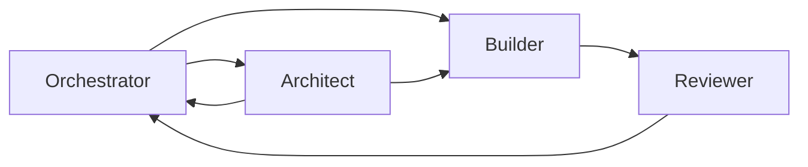

# Agents

## Objetivo

Este documento define a equipe de agentes recomendada para o AI Assets Hub, com foco em qualidade, clareza operacional e economia de contexto ao longo de um projeto grande.

## Modo de Trabalho Atual

Enquanto o projeto estiver perseguindo o menor MVP funcional aprovado, este documento deve ser usado em conjunto com [MVP_WORKING_MODE.md](C:\dev\lg-ai-assets-hub\agents\MVP_WORKING_MODE.md).

O arquivo `MVP_WORKING_MODE.md` tem prioridade operacional para o ciclo atual e define:

- o escopo real do MVP em andamento
- o que esta temporariamente fora de escopo
- como `Orchestrator`, `Architect`, `Builder` e `Reviewer` devem atuar neste recorte
- a ordem recomendada de implementacao

Se houver conflito entre a ambicao mais ampla do produto e o recorte enxuto do MVP atual, os agentes devem seguir `MVP_WORKING_MODE.md`.

## Estrutura Escolhida

A estrutura recomendada possui 4 agentes:

1. `Orchestrator`
2. `Architect`
3. `Builder`
4. `Reviewer`

## Motivações

### Por que nao usar apenas 2 ou 3 agentes

- 2 agentes sobrecarregam cada papel com contexto demais.
- 3 agentes costumam empurrar orquestracao e memoria do projeto para arquiteto ou revisor, aumentando releitura.

### Por que nao usar 5 ou mais no MVP de desenvolvimento

- mais agentes aumentam handoff, custo de coordenacao e repeticao de contexto
- especializacao excessiva cedo demais fragmenta decisoes e dificulta manutencao

### Por que 4 agentes e o melhor equilibrio

- separa decisao, execucao, revisao e coordenacao
- mantem contexto de cada agente estreito
- reduz necessidade de releitura dos documentos centrais
- funciona bem para projeto longo com backlog modular

## Visao Geral dos Agentes

### 1. Orchestrator

Responsavel por:

- roteamento de trabalho
- selecao de tarefas
- controle de dependencias
- minimizacao de contexto carregado por rodada

### 2. Architect

Responsavel por:

- arquitetura
- modelo de dominio
- contratos entre modulos
- decisoes estruturais
- evolucao da documentacao base

### 3. Builder

Responsavel por:

- implementacao das tarefas pequenas e localizadas
- atualizacao do codigo e dos testes afetados
- atualizacao pontual de documentacao quando a tarefa exigir

### 4. Reviewer

Responsavel por:

- revisar riscos
- validar aderencia a arquitetura
- identificar regressao
- conferir consistencia de testes e documentacao

## Trade-offs da Estrutura

Vantagens:

- baixo retrabalho
- baixo consumo de tokens por tarefa
- fronteiras claras
- facilita trabalho paralelo

Desvantagens:

- depende de backlog bem quebrado
- exige disciplina documental
- o `Orchestrator` precisa ser rigoroso ao encaminhar escopo

## Fluxo Operacional Completo

Fluxo recomendado:

1. `Orchestrator` seleciona uma task pequena e define contexto minimo.
2. `Architect` entra apenas se houver decisao estrutural, ambiguidade de dominio ou impacto cross-module.
3. `Builder` executa a tarefa lendo apenas os documentos e arquivos permitidos.
4. `Reviewer` revisa com foco em risco, regressao e aderencia arquitetural.
5. `Orchestrator` fecha a tarefa e atualiza backlog, memoria e proximos passos.

## Regras de Acionamento

- Nem toda tarefa precisa do `Architect`.
- Toda implementacao relevante deve passar por `Reviewer`.
- O `Orchestrator` nunca deve encaminhar tarefa grande demais para um unico ciclo se ela exigir ler o projeto inteiro.

## Estrategia de Longa Duracao

- modularizar conhecimento em documentos pequenos e estaveis
- manter snapshots executivos
- tratar backlog como unidade de contexto
- evitar que `Builder` ou `Reviewer` releiam `PROJECT.md` sem necessidade

## Arquitetura Recomendada

### Estrutura da solucao

- monolito modular com `Next.js`, `ASP.NET Core` e `PostgreSQL`
- modulo de instalacao tratado como subsistema central
- busca no PostgreSQL no MVP
- auditoria e seguranca como capacidades transversais

### Estrutura dos agentes

- `Orchestrator` para governar escopo e contexto
- `Architect` para proteger coerencia estrutural
- `Builder` para executar backlog com escopo local
- `Reviewer` para capturar risco antes de acumular divida

### Estrategia de contexto

- leitura seletiva por tarefa
- snapshots em vez de releitura de documentos extensos
- proibicao explicita de contexto desnecessario por agente

### Estrategia de escalabilidade

- escalar primeiro por modularidade e filas assicronas futuras
- adiar microservicos e busca dedicada ate necessidade real

### Estrategia de evolucao futura

- preparar migracao para SSO
- evoluir installation engine por classes de risco
- permitir extracao futura de busca e instalacao quando o volume justificar
