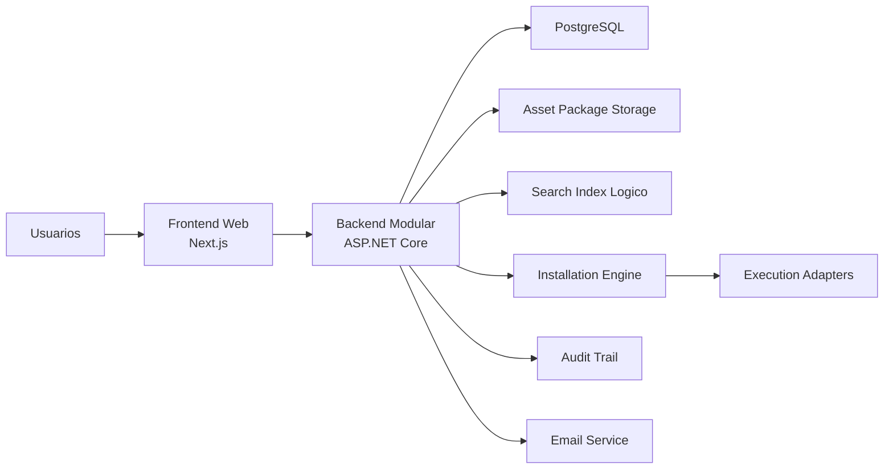
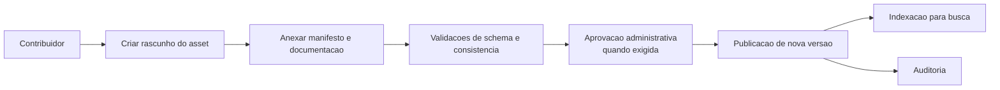
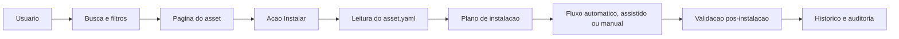

# Architecture

## Objetivo

Este documento define a arquitetura recomendada para o AI Assets Hub com base exclusivamente em [PROJECT.md](C:\dev\lg-ai-assets-hub\PROJECT.md).

O objetivo do produto e centralizar descoberta, compartilhamento, instalacao e reutilizacao de assets de IA com foco em:

- simplicidade operacional
- experiencia de busca
- experiencia de instalacao
- seguranca corporativa
- evolucao gradual sem reescrita estrutural

## Premissas Arquiteturais

- A plataforma e interna corporativa, mas nao deve assumir confianca irrestrita entre usuarios e assets.
- Instalacao e o principal diferencial do produto e, portanto, merece um subsistema proprio.
- O MVP deve ser simples de operar por uma equipe pequena.
- A stack inicial declarada em `PROJECT.md` e obrigatoria para o MVP:
  - Frontend: Next.js, React, TypeScript
  - Backend: ASP.NET Core
  - Banco: PostgreSQL
- A primeira versao nao usara SSO corporativo.
- O sistema deve suportar milhares de assets sem exigir microservicos no inicio.

## Visao de Alto Nivel

Arquitetura recomendada para o MVP: monolito modular orientado a dominios, com separacao clara entre frontend web, backend de aplicacao, banco relacional e mecanismo de instalacao.

## Estilo Arquitetural

### Recomendacao

Adotar monolito modular com boundaries explicitos por modulo de negocio.

### Justificativa

- Reduz complexidade operacional no MVP.
- Facilita transacoes consistentes entre catalogo, versoes, permissoes, favoritos, avaliacoes e auditoria.
- Evita custo prematuro de observabilidade, deploy distribuido e contratos interservicos.
- Permite futura extracao do mecanismo de instalacao ou busca caso volume e risco aumentem.

### Trade-offs

Vantagens:

- menor custo de entrega inicial
- depuracao mais simples
- governanca de dados centralizada
- menor friccao para equipe pequena

Desvantagens:

- maior risco de acoplamento se boundaries nao forem respeitados
- deploy unico pode crescer demais ao longo do tempo
- workloads de busca e instalacao competem por recursos se nao forem isolados logicamente

## Modulos Principais

### 1. Identity and Access

Responsabilidades:

- cadastro de usuario
- autenticacao por e-mail e senha
- confirmacao de e-mail
- recuperacao de senha
- aprovacao opcional por administrador
- controle de dominios corporativos permitidos
- autorizacao baseada em papeis e ownership

Nao deve conter:

- logica de catalogo
- regras de versao de asset
- execucao de instalacao

### 2. Asset Catalog

Responsabilidades:

- cadastro e edicao de assets
- metadados principais
- categorias e tags
- equipe responsavel
- status de publicacao
- historico editorial do asset

Nao deve conter:

- armazenamento detalhado de instalacao
- execucao de passos

### 3. Asset Versioning

Responsabilidades:

- versoes publicadas de cada asset
- changelog
- autor da alteracao
- datas de publicacao e atualizacao
- relacao entre versao e manifesto `asset.yaml`
- regras de transicao de rascunho para publicado

### 4. Search and Discovery

Responsabilidades:

- busca global por nome, descricao, autor, categoria, tags e equipe
- filtros por categoria, data, popularidade e nivel tecnico
- ordenacao e ranking
- destaque de novos assets e mais instalados

### 5. Installation Engine

Responsabilidades:

- interpretar `asset.yaml`
- validar pre-requisitos
- decidir modo de instalacao
- orquestrar assistente de instalacao
- registrar execucoes e resultados
- validar pos-instalacao

Este modulo e o coracao operacional do produto.

### 6. Social and Feedback

Responsabilidades:

- curtidas
- estrelas
- comentarios
- favoritos

### 7. Governance and Moderation

Responsabilidades:

- aprovacao de publicacoes
- gestao de categorias
- gestao de dominios permitidos
- analise de metricas
- governanca sobre assets sensiveis

### 8. Audit and Compliance

Responsabilidades:

- trilha de auditoria
- eventos administrativos
- eventos de autenticacao
- eventos de publicacao
- eventos de instalacao
- rastreabilidade de alteracoes

## Boundaries e Contratos

### Frontend

Responsavel por:

- experiencia de descoberta
- formularios guiados
- dashboard
- wizard de instalacao assistida
- visualizacao de versoes, comentarios e documentacao

Nao responsavel por:

- validacao de seguranca final
- execucao de instalacao
- autorizacao real

### Backend

Responsavel por:

- aplicar regras de negocio
- aplicar autorizacao
- persistir dados
- produzir eventos de auditoria
- coordenar instalacao

### Banco de Dados

Responsavel por:

- consistencia transacional
- consultas operacionais
- historico relacional

### Asset Package Storage

Responsavel por:

- armazenar anexos, scripts, documentacao complementar e manifestos versionados

### Installation Engine

Responsavel por:

- interpretar manifesto
- transformar declaracao em plano de execucao
- garantir rastreabilidade

Nao deve:

- permitir execucao arbitraria sem politica
- depender de logica da interface

## Fluxos Principais

### Publicacao de Asset

### Descoberta e Instalacao

## Estrategia de Escalabilidade

### MVP

- aplicacao unica do backend
- banco PostgreSQL unico
- armazenamento de arquivos desacoplado do banco
- indexacao de busca dentro do proprio PostgreSQL

### Evolucao

- extrair busca para mecanismo dedicado apenas quando PostgreSQL nao atingir SLA
- extrair installation engine para worker/service dedicado apenas quando houver concorrencia alta, execucoes longas ou necessidade de isolamento forte
- adicionar fila para tarefas assincronas quando validacao, indexacao ou notificacoes crescerem

## Busca e Performance

Meta declarada: busca inferior a 2 segundos.

Recomendacao para MVP:

- usar indexacao textual no PostgreSQL
- denormalizar campos de busca em estrutura apropriada para catalogo
- paginacao obrigatoria
- filtros compostos por categoria, nivel tecnico, equipe e data

Trade-off:

- PostgreSQL atende bem o MVP e reduz stack
- motores dedicados de busca devem ser adiados ate que relevancia, typo tolerance ou escala exijam

## Estrategia de Entrega

### Recomendada para o MVP

Arquitetura em camadas internas:

- Presentation
- Application
- Domain
- Infrastructure

Organizacao por modulo de negocio dentro dessas camadas:

- identity
- catalog
- versioning
- installation
- feedback
- governance
- audit
- dashboard

Isto combina simplicidade operacional com capacidade de crescimento.

## Riscos Tecnicos

### 1. `asset.yaml` permissivo demais

Se o manifesto permitir scripts arbitrarios sem restricoes, o produto vira um vetor de risco interno.

Mitigacao:

- schema formal do manifesto
- tipos de passo permitidos e versionados
- politica de aprovacao por tipo de risco
- execucao assistida ou manual para operacoes sensiveis

### 2. Experiencia de instalacao inconsistente

Assets com qualidades muito diferentes podem degradar a confianca na plataforma.

Mitigacao:

- contrato minimo obrigatorio para todo asset
- score de qualidade do manifesto
- badges de maturidade do instalador

### 3. Acoplamento entre publicacao e instalacao

Se publicacao aprovar qualquer asset sem validacoes de manifesto, a etapa de instalacao absorvera erros demais.

Mitigacao:

- validacao de schema no upload
- checklist de publicacao
- aprovacao opcional baseada em risco

### 4. Governanca insuficiente de versoes

Atualizacoes mal definidas podem quebrar instalacoes e gerar perda de confianca.

Mitigacao:

- versionamento semantico recomendado
- changelog obrigatorio
- compatibilidade declarada

### 5. Moderacao e comentarios

Comentarios podem conter segredos, links sensiveis ou instrucoes inseguras.

Mitigacao:

- termos de uso internos
- moderacao administrativa
- auditoria de comentarios editados ou removidos

## Requisitos que Merecem Refinamento Futuro

- O que exatamente significa "instalar" para cada tipo de asset.
- Se instalacao deve ocorrer no navegador, localmente no desktop do usuario, ou em ambiente corporativo controlado.
- Quais categorias exigem aprovacao obrigatoria.
- Se um asset pode depender de outro asset da plataforma.
- Como lidar com compatibilidade entre versoes de ferramentas externas.
- Se comentarios serao publicos para toda a empresa ou restritos por time.

## Arquitetura Recomendada

### MVP

Tecnologias e decisoes a adotar:

- Next.js + React + TypeScript no frontend
- ASP.NET Core no backend
- PostgreSQL como banco principal e mecanismo inicial de busca
- monolito modular com boundaries explicitos
- autenticacao propria com e-mail, senha, confirmacao e recuperacao
- RBAC simples com papeis `User`, `Contributor`, `Admin`
- `asset.yaml` como contrato canonico de instalacao
- installation engine declarativo com tres modos: automatico, assistido e manual
- armazenamento versionado de manifestos, anexos e documentacao
- auditoria centralizada para autenticacao, publicacao, permissoes e instalacao

Padroes a adotar:

- DDD leve para separar modulos e linguagem de negocio
- Clean Architecture nas dependencias internas
- versionamento semantico para assets
- eventos de dominio internos apenas onde houver valor claro de auditoria ou integracao

### Pos-MVP

Decisoes a adiar:

- microservicos
- fila obrigatoria para todo fluxo
- mecanismo externo de busca
- SSO corporativo
- recomendacao baseada em comportamento
- execucao totalmente remota e isolada de instalacao
- marketplace multi-tenant
- workflow complexo de aprovacao multinivel

Racional:

Esses itens aumentam custo operacional e complexidade antes de o produto validar seu principal valor, que e descoberta rapida com instalacao confiavel.
