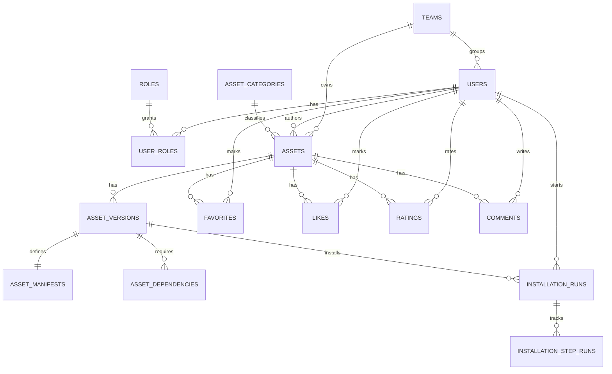

# Database

## Objetivo

Definir a estrategia de persistencia e o modelo relacional recomendado para o AI Assets Hub no MVP.

Banco definido em requisito: PostgreSQL.

## Principios

- Priorizar modelo relacional por consistencia e governanca.
- Evitar poliglot persistence no MVP.
- Separar entidades operacionais, historicas e de auditoria.
- Tratar `asset.yaml` como artefato versionado, com armazenamento do conteudo bruto e de campos indexaveis.

## Estrategia de Persistencia

### PostgreSQL como sistema principal

Responsavel por:

- identidade e acesso
- catalogo de assets
- versoes
- favoritos e avaliacoes
- auditoria
- metricas operacionais basicas
- busca inicial

### Armazenamento complementar de arquivos

Recomendacao:

- armazenar arquivos pesados fora do banco e manter referencias no PostgreSQL

Exemplos:

- anexos
- documentacao complementar
- scripts
- bundles de instalacao

Justificativa:

- evita inflar o banco
- simplifica backup e restauracao
- facilita distribuicao futura

## Esquema Logico Recomendado

### Namespace `identity`

Tabelas principais:

- `users`
- `roles`
- `user_roles`
- `allowed_email_domains`
- `password_reset_tokens`
- `email_verification_tokens`

### Namespace `catalog`

Tabelas principais:

- `assets`
- `asset_categories`
- `tags`
- `asset_tags`
- `teams`
- `asset_documents`
- `asset_attachments`

### Namespace `versioning`

Tabelas principais:

- `asset_versions`
- `asset_manifests`
- `asset_dependencies`
- `publication_reviews`

### Namespace `installation`

Tabelas principais:

- `installation_profiles`
- `installation_runs`
- `installation_step_runs`
- `installation_validations`

### Namespace `feedback`

Tabelas principais:

- `favorites`
- `likes`
- `ratings`
- `comments`

### Namespace `audit`

Tabelas principais:

- `audit_events`

### Namespace `analytics`

Tabelas principais:

- `asset_daily_metrics`

## Tabelas Conceituais

### `identity.users`

Colunas recomendadas:

- `id`
- `full_name`
- `email`
- `password_hash`
- `email_confirmed_at`
- `approval_status`
- `account_status`
- `team_id`
- `created_at`
- `updated_at`
- `last_login_at`

Restricoes:

- `email` unico
- dominio derivado deve ser validado na camada de aplicacao e, idealmente, reforcado por processo de negocio

### `catalog.assets`

Colunas recomendadas:

- `id`
- `name`
- `slug`
- `short_description`
- `detailed_description`
- `category_id`
- `author_user_id`
- `owner_team_id`
- `technical_level`
- `publication_status`
- `current_published_version_id`
- `created_at`
- `updated_at`
- `published_at`
- `archived_at`

Indices recomendados:

- `slug` unico
- `category_id`
- `owner_team_id`
- `publication_status`
- combinacoes para ordenacao por data

### `versioning.asset_versions`

Colunas recomendadas:

- `id`
- `asset_id`
- `version`
- `version_major`
- `version_minor`
- `version_patch`
- `release_notes`
- `created_by_user_id`
- `version_status`
- `published_at`
- `created_at`
- `updated_at`

Restricoes:

- unicidade por `asset_id + version`

### `versioning.asset_manifests`

Colunas recomendadas:

- `id`
- `asset_version_id`
- `schema_version`
- `installation_mode`
- `manifest_content`
- `manifest_hash`
- `validation_status`
- `validated_at`
- `created_at`

Observacoes:

- `manifest_content` pode ser armazenado como texto bruto
- campos-chave de busca e filtro podem ser extraidos para colunas auxiliares

### `versioning.asset_dependencies`

Colunas recomendadas:

- `id`
- `asset_version_id`
- `dependency_type`
- `name`
- `version_constraint`
- `is_required`
- `source_reference`

### `installation.installation_runs`

Colunas recomendadas:

- `id`
- `asset_version_id`
- `started_by_user_id`
- `installation_mode`
- `status`
- `input_snapshot`
- `started_at`
- `completed_at`
- `result_summary`
- `validation_result`

Indices recomendados:

- `asset_version_id`
- `started_by_user_id`
- `status`
- `started_at desc`

### `installation.installation_step_runs`

Colunas recomendadas:

- `id`
- `installation_run_id`
- `step_order`
- `step_name`
- `step_type`
- `status`
- `started_at`
- `completed_at`
- `output_log_reference`
- `error_summary`

### `feedback.ratings`

Colunas recomendadas:

- `id`
- `asset_id`
- `user_id`
- `stars`
- `created_at`
- `updated_at`

Restricoes:

- um usuario deve possuir apenas uma avaliacao vigente por asset

### `feedback.comments`

Colunas recomendadas:

- `id`
- `asset_id`
- `user_id`
- `content`
- `comment_status`
- `created_at`
- `updated_at`
- `deleted_at`

### `audit.audit_events`

Colunas recomendadas:

- `id`
- `event_type`
- `actor_user_id`
- `target_type`
- `target_id`
- `metadata_json`
- `occurred_at`
- `ip_address`
- `correlation_id`

## Relacionamentos Principais

## Estrategia de Busca

### MVP

Usar PostgreSQL para busca textual e filtros.

Campos prioritarios para indexacao:

- nome do asset
- descricao curta
- descricao detalhada
- autor
- categoria
- tags
- equipe

Recomendacoes:

- materializar texto pesquisavel consolidado
- manter indices para filtro
- evitar joins excessivos na consulta principal de listagem

### Futuro

Extrair para mecanismo dedicado apenas se:

- relevancia de busca ficar insatisfatoria
- typo tolerance virar requisito
- volume ultrapassar conforto operacional do PostgreSQL

## Estrategia de Versionamento no Banco

Recomendacao:

- `assets` contem identidade do produto
- `asset_versions` contem releases
- `asset_manifests` contem contrato instalavel imutavel por release

Consequencias:

- historico claro
- rastreabilidade por versao
- instalacao sempre referenciando artefato preciso

## Estrategia de Auditoria no Banco

Recomendacao:

- auditoria em tabela append-only
- metadata em JSON para flexibilidade
- correlar eventos por `correlation_id`

Eventos minimos:

- cadastro
- confirmacao de e-mail
- login
- recuperacao de senha
- alteracao de permissao
- criacao e edicao de asset
- publicacao de versao
- aprovacao ou rejeicao
- inicio e fim de instalacao

## Retencao e Crescimento

Pontos de crescimento esperado:

- `audit_events`
- `installation_step_runs`
- `comments`
- metricas diarias

Recomendacoes:

- particionamento futuro por data para auditoria e instalacoes, se necessario
- politicas de arquivamento logico para dados operacionais antigos
- sumarizacao periodica para dashboards

## Riscos e Trade-offs

### Manifesto apenas como blob

Risco:

- dificulta filtros e validacoes analiticas

Mitigacao:

- armazenar conteudo bruto e extrair campos selecionados

### Comentarios sem moderacao

Risco:

- contaminacao da base com conteudo inadequado ou sensivel

Mitigacao:

- status de comentario e trilha de moderacao

### Busca com joins demais

Risco:

- degradacao acima da meta de 2 segundos

Mitigacao:

- visao materializada ou tabela de indice logico mantida pela aplicacao
