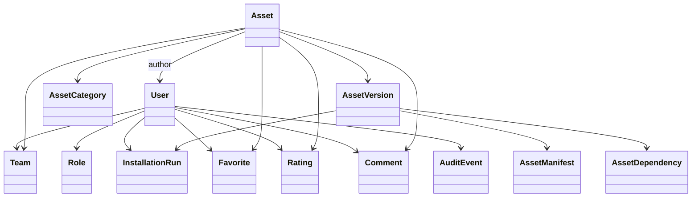

# Domain Model

## Objetivo

Este documento descreve o modelo conceitual de dominio do AI Assets Hub, seus agregados, entidades, objetos de valor e relacionamentos.

## Bounded Contexts

Os contextos recomendados para o MVP sao:

- Identity and Access
- Asset Catalog
- Asset Versioning
- Installation
- Feedback and Engagement
- Governance
- Audit
- Analytics and Dashboard

## Entidades Principais

### User

Representa uma pessoa autenticada na plataforma.

Campos conceituais:

- `id`
- `full_name`
- `email`
- `password_hash`
- `email_confirmed`
- `account_status`
- `approval_status`
- `created_at`
- `last_login_at`

Observacoes:

- o e-mail e a identidade principal de login
- o dominio do e-mail deve pertencer a uma lista permitida
- `account_status` e diferente de `approval_status`

### Role

Representa um papel global de autorizacao.

Valores iniciais:

- `User`
- `Contributor`
- `Admin`

### Team

Representa a equipe responsavel por um asset ou vinculada ao usuario.

Campos conceituais:

- `id`
- `name`
- `description`
- `is_active`

### Asset

Representa o item canonico compartilhado na plataforma.

Campos conceituais:

- `id`
- `name`
- `slug`
- `short_description`
- `detailed_description`
- `category_id`
- `technical_level`
- `author_user_id`
- `owner_team_id`
- `current_published_version_id`
- `visibility_status`
- `publication_status`
- `created_at`
- `updated_at`

Observacoes:

- `Asset` e a identidade permanente
- versoes ficam em entidade separada
- `publication_status` controla rascunho, em revisao, publicado, arquivado

### AssetCategory

Representa a classificacao principal do asset.

Categorias iniciais derivadas do requisito:

- Agente
- MCP Server
- Prompt
- Skill
- Plugin
- Workflow
- Integracao
- Automacao
- Ferramenta Desktop
- Ferramenta Web
- Template
- Outro

### Tag

Representa rotulos livres para busca e descoberta.

### AssetVersion

Representa uma versao especifica de um asset.

Campos conceituais:

- `id`
- `asset_id`
- `version`
- `release_notes`
- `manifest_id`
- `documentation_bundle_id`
- `created_by_user_id`
- `published_at`
- `updated_at`
- `version_status`
- `is_latest`

Observacoes:

- `version` deve seguir estrategia semantica recomendada
- `version_status` permite rascunho e publicado sem duplicar `Asset`

### AssetManifest

Representa o conteudo versionado do `asset.yaml`.

Campos conceituais:

- `id`
- `asset_version_id`
- `schema_version`
- `installation_mode`
- `manifest_content`
- `manifest_hash`
- `validated_at`
- `validation_status`

Observacoes:

- manifesto e imutavel depois de publicado
- armazenar hash ajuda em auditoria e integridade

### AssetDependency

Representa dependencia declarada de uma versao para outra capacidade.

Tipos esperados:

- dependencia de software externo
- dependencia de ambiente
- dependencia de configuracao
- dependencia de outro asset

### InstallationProfile

Representa configuracoes necessarias para instalar um asset em um contexto do usuario.

Campos conceituais:

- `id`
- `user_id`
- `asset_version_id`
- `profile_name`
- `input_values`
- `last_used_at`

Observacoes:

- ajuda a reduzir friccao em reinstalacoes
- deve tratar segredos com politica especifica

### InstallationRun

Representa uma tentativa de instalacao.

Campos conceituais:

- `id`
- `asset_version_id`
- `started_by_user_id`
- `installation_mode`
- `run_status`
- `started_at`
- `completed_at`
- `validation_result`
- `execution_summary`

### InstallationStepRun

Representa a execucao de um passo do plano de instalacao.

Campos conceituais:

- `id`
- `installation_run_id`
- `step_name`
- `step_type`
- `step_order`
- `status`
- `started_at`
- `completed_at`
- `output_log_reference`

### Favorite

Relaciona usuario e asset favorito.

### Like

Relaciona usuario e asset curtido.

### Rating

Representa avaliacao por estrelas de um usuario para um asset.

Campos conceituais:

- `id`
- `user_id`
- `asset_id`
- `stars`
- `created_at`
- `updated_at`

### Comment

Representa comentario associado a um asset.

Campos conceituais:

- `id`
- `asset_id`
- `user_id`
- `content`
- `comment_status`
- `created_at`
- `updated_at`

### PublicationReview

Representa a aprovacao administrativa de um asset ou versao quando aplicavel.

Campos conceituais:

- `id`
- `asset_version_id`
- `reviewed_by_user_id`
- `decision`
- `decision_reason`
- `reviewed_at`

### AuditEvent

Representa evento de auditoria.

Campos conceituais:

- `id`
- `event_type`
- `actor_user_id`
- `target_type`
- `target_id`
- `metadata`
- `occurred_at`
- `ip_address`

### AllowedEmailDomain

Representa dominios aceitos para cadastro.

Campos conceituais:

- `id`
- `domain`
- `is_active`
- `created_at`

## Objetos de Valor Relevantes

### EmailAddress

- valor normalizado
- contem dominio derivado
- validado contra lista permitida

### AssetVersionNumber

- representa versao semantica recomendada
- permite ordenacao consistente

### PublicationStatus

Valores sugeridos:

- `Draft`
- `UnderReview`
- `Published`
- `Rejected`
- `Archived`

### InstallationMode

Valores derivados do requisito:

- `Automatic`
- `Assisted`
- `Manual`

### TechnicalLevel

Filtro previsto no requisito.

Valores sugeridos:

- `Beginner`
- `Intermediate`
- `Advanced`

### AccountStatus

Valores sugeridos:

- `PendingEmailConfirmation`
- `PendingAdminApproval`
- `Active`
- `Suspended`

## Relacionamentos

## Agregados Recomendados

### Aggregate: User

Raiz:

- `User`

Entidades internas relacionadas por politica:

- papeis do usuario
- aprovacao de conta

### Aggregate: Asset

Raiz:

- `Asset`

Relacionados por consistencia de negocio:

- `AssetVersion`
- `AssetManifest`
- `AssetDependency`

Regras criticas:

- uma versao publicada nao deve ser alterada livremente
- um asset deve apontar para a versao publicada atual
- publicacao deve gerar trilha de auditoria

### Aggregate: InstallationRun

Raiz:

- `InstallationRun`

Entidades associadas:

- `InstallationStepRun`

Regras criticas:

- historico de execucao deve ser imutavel para fins de rastreabilidade
- logs podem ser enriquecidos, mas nao sobrescritos sem rastro

### Aggregate: PublicationReview

Raiz:

- `PublicationReview`

Objetivo:

- manter integridade do workflow de aprovacao

## Regras de Negocio Estruturais

- Um usuario so pode se cadastrar com dominio corporativo permitido.
- Um asset pertence a uma categoria e possui um autor principal.
- Um asset pode ter varias versoes ao longo do tempo.
- Cada versao publicada deve possuir um `asset.yaml` valido.
- Todo asset deve possuir algum metodo de instalacao.
- Comentarios, likes, estrelas e favoritos pertencem ao asset, nao a uma versao especifica no MVP.
- Instalacoes devem referenciar uma versao especifica do asset.
- Um administrador pode aprovar ou rejeitar publicacoes quando a governanca exigir.

## Decisoes de Modelagem

### Avaliacao no nivel do asset

Recomendacao:

- manter likes, estrelas e favoritos no nivel do `Asset` no MVP

Justificativa:

- simplifica UX
- melhora leitura de popularidade
- evita fragmentacao entre versoes

Trade-off:

- perde granularidade para saber se uma versao especifica piorou ou melhorou

### Comentarios no nivel do asset

Recomendacao:

- comentarios associados ao asset, com opcao de mencionar versao em metadata

Justificativa:

- reduz complexidade de navegacao
- mantem foco na solucao como produto

### Equipe como entidade de referencia

Recomendacao:

- manter `Team` como entidade propria, nao apenas texto livre

Justificativa:

- melhora filtro de busca
- melhora governanca
- reduz inconsistencias de grafia

## Pontos de Atencao

- O requisito nao define se um asset pode ter multiplos autores formais.
- O requisito nao define se assets podem ser privados por equipe.
- O requisito nao define se comentarios exigem moderacao previa.
- O requisito nao define se instalacoes armazenam parametros sensiveis do usuario.

Esses pontos devem ser refinados antes da implementacao de autorizacao fina e do installation engine.
