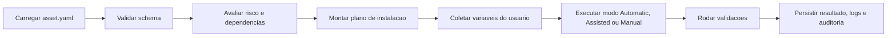

# Installation Engine

## Objetivo

Definir o mecanismo de instalacao do AI Assets Hub, guiado por `asset.yaml`, cobrindo modos de execucao, validacao, seguranca, versionamento e experiencia do usuario.

Este documento trata o mecanismo de instalacao como o requisito mais importante do sistema.

## Principios

- Todo asset deve possuir uma experiencia de instalacao clara.
- O manifesto `asset.yaml` e o contrato canonico entre contribuicao e execucao.
- A instalacao deve ser previsivel, auditavel e compreensivel por usuarios nao tecnicos.
- Seguranca e rastreabilidade valem mais que automacao irrestrita.

## Objetivos Funcionais

O installation engine deve:

- interpretar metadados do manifesto
- validar o schema do manifesto
- identificar dependencias
- coletar variaveis necessarias
- gerar um plano de instalacao
- executar fluxo automatico, assistido ou manual
- executar validacoes pos-instalacao
- registrar historico de instalacao

## Conceito de `asset.yaml`

Campos obrigatorios declarados em requisito:

- metadados
- dependencias
- variaveis
- passos de instalacao
- passos de validacao

### Papel do manifesto

O manifesto nao deve ser visto como simples arquivo de configuracao. Ele e um contrato versionado que:

- descreve como instalar
- informa risco
- suporta validacoes previas
- orienta a interface do wizard
- gera rastreabilidade

## Estrutura Conceitual Recomendada do Manifesto

Sem definir sintaxe final, o manifesto deve cobrir os seguintes blocos conceituais:

- identificacao do asset e da versao
- versao do schema do manifesto
- modo de instalacao suportado
- dependencias
- variaveis de entrada
- passos de instalacao
- passos de validacao
- compatibilidade
- observacoes de seguranca

## Pipeline Conceitual de Instalacao

## Modos de Instalacao

### Nivel 1. Instalacao Automatica

Experiencia:

- um botao `Instalar`

Criterios recomendados para permitir:

- manifesto com risco baixo
- passos padronizados e previsiveis
- baixa necessidade de decisao do usuario
- validacoes objetivas

Trade-off:

- melhor UX
- maior exigencia de confianca e controle no manifesto

### Nivel 2. Instalacao Assistida

Experiencia:

- wizard passo a passo

Fluxo derivado do requisito:

- verificacao de dependencias
- configuracao
- instalacao
- validacao

Quando usar:

- configuracoes dependem do contexto do usuario
- existem pre-requisitos relevantes
- e preciso tornar passos transparentes

### Nivel 3. Instalacao Manual

Experiencia:

- exibicao de scripts, comandos e documentacao

Quando usar:

- operacao nao pode ser automatizada com seguranca
- depende de ambiente muito variavel
- exige contexto tecnico alto

Trade-off:

- menor automacao
- menor risco operacional da plataforma

## Motor de Decisao de Modo

Recomendacao:

- o manifesto declara o modo primario
- a plataforma pode rebaixar automaticamente o modo por politica de seguranca

Exemplos:

- um asset marcado como automatico pode ser convertido para assistido se incluir dependencias nao resolvidas
- um asset de alto risco pode ser convertido para manual no MVP

## Componentes Logicos do Engine

### 1. Manifest Validator

Responsabilidades:

- validar schema versionado
- validar coerencia interna
- identificar campos obrigatorios ausentes
- classificar risco preliminar

### 2. Dependency Analyzer

Responsabilidades:

- identificar dependencias obrigatorias e opcionais
- separar dependencias internas de externas
- informar lacunas ao usuario

### 3. Configuration Resolver

Responsabilidades:

- coletar variaveis do usuario
- validar formato e obrigatoriedade
- tratar segredos separadamente

### 4. Installation Planner

Responsabilidades:

- transformar declaracao em plano ordenado
- indicar passos, validacoes e checkpoints
- produzir narrativa compreensivel para o wizard

### 5. Execution Coordinator

Responsabilidades:

- orquestrar execucao do plano
- registrar cada etapa
- capturar erros e pontos de falha

### 6. Validation Runner

Responsabilidades:

- executar validacoes pos-instalacao
- classificar sucesso total, parcial ou falha

### 7. Installation Audit Logger

Responsabilidades:

- persistir inicio, etapas, fim, mensagens e resultado

## Estrategia de Versionamento

O manifesto precisa de dois tipos de versionamento:

### 1. Versao do asset

- pertence ao `AssetVersion`
- comunica release funcional do asset

### 2. Versao do schema do manifesto

- controla evolucao do contrato `asset.yaml`
- permite compatibilidade progressiva do engine

Recomendacao:

- nao acoplar schema do manifesto diretamente a versao do asset

Justificativa:

- um mesmo schema serve para varios assets
- o engine evolui independentemente do conteudo do asset

## Estrategia de Compatibilidade

Recomendacao:

- engine deve suportar mais de uma versao de schema simultaneamente
- publicar matriz de compatibilidade
- impedir publicacao de manifestos com schema obsoleto apos janela de transicao

## Estrategia de Auditoria

Eventos a registrar:

- manifesto validado
- manifesto rejeitado
- instalacao iniciada
- dependencia faltante detectada
- variavel obrigatoria nao informada
- etapa executada
- etapa falhou
- validacao final aprovada ou reprovada

Recomendacao:

- armazenar snapshot do manifesto usado na execucao
- vincular logs ao `installation_run_id`

## UX de Instalacao Recomendada

Para usuarios nao tecnicos, a UX deve responder sempre a estas perguntas:

- O que este asset faz?
- O que sera instalado ou configurado?
- O que eu preciso informar?
- O que pode falhar?
- Como saber se funcionou?

### Tela de instalacao recomendada

- resumo do asset
- modo de instalacao
- nivel tecnico
- dependencias
- risco
- estimativa de passos
- botao de iniciar

### Wizard assistido recomendado

Passos:

1. Validacao de ambiente
2. Coleta de configuracoes
3. Revisao do plano
4. Execucao
5. Validacao final
6. Resultado com proximos passos

## Politicas de Seguranca do Engine

- sem manifesto valido nao ha instalacao
- passos sensiveis exigem classificacao de risco
- logs nao devem expor segredos
- execucao automatica deve ser restrita no MVP

## Riscos Tecnicos

### 1. Ambiguidade no significado de "instalar"

Problema:

- um prompt, um plugin e uma ferramenta desktop possuem instalacoes muito diferentes

Recomendacao:

- definir tipologia de instalacao por categoria de asset

### 2. Manifesto excessivamente generico

Problema:

- engine vira interpretador aberto demais

Recomendacao:

- comecar com conjunto pequeno de tipos de passo suportados

### 3. Falta de isolamento

Problema:

- automacao pode produzir efeitos colaterais nao rastreados

Recomendacao:

- no MVP, privilegiar assistencia e manualidade para cenarios de alto risco

## Requisitos que Devem Ser Refinados Antes da Implementacao

- Onde a instalacao executa de fato.
- Quais tipos de passo sao permitidos no MVP.
- Se assets podem depender de outros assets da plataforma.
- Quais categorias podem ter modo automatico no MVP.
- Como tratar rollback ou uninstall.

## Recomendacao Executiva

Para o MVP, o installation engine deve ser declarativo, restritivo e guiado por wizard. A melhor experiencia nao e a mais automatica; e a mais previsivel. O sistema deve comecar suportando automacao apenas onde houver baixo risco, deixando cenarios complexos como assistidos ou manuais.
