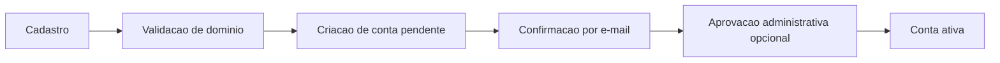

# Security

## Objetivo

Definir a arquitetura de seguranca do AI Assets Hub para o MVP, com foco especial em autenticacao, autorizacao, instalacao e auditoria.

## Principios

- Tratar a plataforma como ambiente interno, mas nao como ambiente confiavel por padrao.
- Minimizar privilegios.
- Tornar toda acao sensivel auditavel.
- Proteger usuarios nao tecnicos contra instalacoes inseguras ou ambiguidade operacional.
- Priorizar mecanismos simples e robustos no MVP.

## Superficies de Risco

As maiores superficies de risco sao:

- cadastro e autenticacao propria
- upload de manifestos e scripts
- execucao de instalacao
- comentarios e documentacao publicada por usuarios
- administracao de permissoes

## Autenticacao

Requisitos declarados:

- autenticacao propria
- e-mail e senha
- confirmacao por e-mail
- recuperacao de senha
- aprovacao opcional por administrador
- restricao por dominios corporativos autorizados

### Recomendacoes

- exigir confirmacao de e-mail antes de ativacao plena
- permitir aprovacao administrativa configuravel por politica
- usar hash de senha forte com algoritmo moderno e parametrizado
- aplicar limite de tentativas e mecanismos anti-abuso
- registrar eventos de login, falha de login e reset

### Fluxo recomendado

## Autorizacao

### Modelo recomendado

Adotar RBAC simples no MVP com ownership complementar.

Papeis:

- `User`
- `Contributor`
- `Admin`

Ownership:

- autor do asset
- equipe responsavel

### Matriz de permissoes recomendada

| Acao | User | Contributor | Admin |
|---|---|---|---|
| Buscar e visualizar assets publicados | Sim | Sim | Sim |
| Favoritar, curtir, avaliar, comentar | Sim | Sim | Sim |
| Criar asset | Nao | Sim | Sim |
| Editar asset proprio | Nao | Sim | Sim |
| Publicar nova versao propria | Nao | Sim | Sim |
| Aprovar publicacao | Nao | Nao | Sim |
| Gerenciar categorias | Nao | Nao | Sim |
| Gerenciar dominios permitidos | Nao | Nao | Sim |
| Gerenciar usuarios e papeis | Nao | Nao | Sim |
| Visualizar metricas administrativas | Nao | Nao | Sim |

### Decisoes importantes

- `Contributor` nao deve administrar papeis.
- `Admin` nao deve editar silenciosamente um asset sem trilha de auditoria.
- a aprovacao de publicacao deve ser separada da autoria quando politica exigir.

## Seguranca do `asset.yaml`

Este e o ponto mais critico da plataforma.

### Risco estrutural

O manifesto define como o asset sera instalado. Se for permissivo demais, pode introduzir execucao insegura, dependencia de ambiente nao controlado e baixa previsibilidade.

### Recomendacoes de seguranca

- definir schema versionado e estrito
- permitir apenas tipos de passo conhecidos
- classificar risco do manifesto no upload
- bloquear ou exigir revisao para passos sensiveis
- exigir validacao do manifesto antes da publicacao

### Classificacao de risco sugerida

- `Low`: operacoes documentais ou configuracoes simples
- `Medium`: instalacao assistida com dependencias externas
- `High`: execucao de scripts, alteracao de sistema, credenciais, rede ou automacao local

### Politica recomendada

- assets de risco alto exigem aprovacao administrativa
- assets de risco alto nao devem ter instalacao "um clique" no MVP
- sempre exibir o que sera feito antes de executar

## Segredos e Configuracoes

O requisito menciona variaveis no manifesto. Isso pode incluir dados sensiveis.

Recomendacoes:

- nunca armazenar segredos em texto puro junto ao manifesto publicado
- separar definicao de variavel do valor fornecido pelo usuario
- mascarar segredos em logs e auditoria
- limitar reuso de segredos em perfis de instalacao

## Seguranca de Conteudo Publicado

Conteudos com risco:

- scripts anexados
- comandos manuais
- comentarios
- documentacao

Recomendacoes:

- sanitizar renderizacao de conteudo rico
- validar anexos permitidos por tipo
- registrar quem publicou e quem alterou
- permitir moderacao e ocultacao administrativa

## Protecao de Dados

Dados sensiveis envolvidos:

- credenciais de usuario
- tokens de confirmacao
- tokens de reset
- possiveis entradas de instalacao
- IP e trilhas de auditoria

Recomendacoes:

- minimizacao de dados
- criptografia em transito via HTTPS
- politicas claras de retencao para logs
- controle de acesso restrito a dados de auditoria

## Auditoria de Seguranca

Eventos minimos a auditar:

- cadastro
- tentativa de login
- login bem-sucedido
- falha de autenticacao
- confirmacao de e-mail
- reset de senha
- mudanca de papel
- criacao e edicao de asset
- publicacao e aprovacao
- instalacao iniciada
- instalacao concluida
- instalacao falhada
- moderacao de comentario

## Controles Recomendados por Camada

### Frontend

- nao confiar em validacoes locais como controle de seguranca
- exibir risco de instalacao de forma clara
- exigir confirmacao explicita para passos sensiveis

### Backend

- autorizacao centralizada
- validacao de schema do manifesto
- assinatura logica de eventos de auditoria
- aplicacao de politicas por papel e por risco

### Banco

- segregacao logica de dados de auditoria
- acesso administrativo restrito

## Ameacas Prioritarias

### 1. Cadastro indevido com dominio nao autorizado

Mitigacao:

- validar dominio antes de criar conta ativa
- manter lista administravel e auditavel de dominios

### 2. Tomada de conta por senha fraca ou reset abusivo

Mitigacao:

- algoritmo de hash robusto
- expiracao curta de tokens
- trilha de reset

### 3. Asset malicioso ou inseguro

Mitigacao:

- schema estrito
- aprovacao por risco
- instalacao assistida para cenarios sensiveis

### 4. Escalada de privilegios administrativa

Mitigacao:

- auditoria append-only
- separacao clara entre contribuicao e administracao

### 5. Vazamento de segredos em logs

Mitigacao:

- mascaramento
- revisao de campos armazenados

## Itens Deliberadamente Adiados

Para nao comprometer o MVP com excesso de complexidade:

- SSO corporativo
- ABAC completo
- IAM externo
- engine de policy complexa
- isolamento forte de execucao remota

Esses itens sao importantes, mas devem entrar quando o produto validar fluxo, volume e sensibilidade real das instalacoes.
